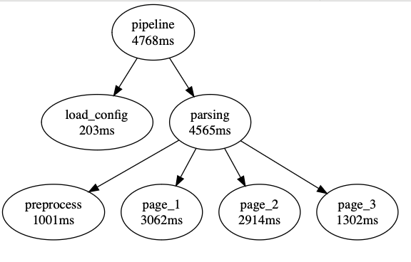
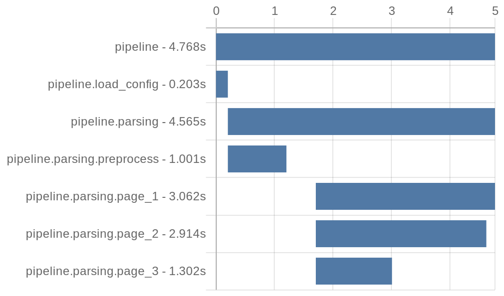

# StepsTrack

StepsTrack is a lightweight and very simple TypeScript library for ***tracking, profiling, and visualizing*** hierarchical intermediate steps in a ***pipeline-based application***. It helps break down complex logic flows into smaller steps, records intermediate execution time and data, and visualizes the execution in human-readable graphs to help debuging and optimizing. It best works in pipeline functions that consists of complex logic execution flows and multiple concurrent async functions.

### Background
StepsTrack was initially developed to debug and track an agentic *Retrieval-Augmented Generation (RAG) pipeline* in production where monitoring and optimization are crucial. Chain-ing multiple LLM agents with custom logic and dynamic data inputs often led to unstable results and long response times, especially in production environment where multiple requests are running concurrently. 

To address these challenges, I created StepsTrack as a profiling and debugging tool so I could trace what had happend underlying in each requests and identify bottlenecks upon each pipeline runs. I found it very handy and useful and am sharing with anyone tackling similar challenges in their pipelines.

## Features

- 👣 **Tracking**: Tracks intermediates data, results, execution time and hierachy of the intermediate steps.
- 📊 **Gantt chart**: Visualizes step execution times.
- ⛓️ **Execution graph**: Visualizes step execution dependencies, time and ordering.
- 🎯 **Event Emmitting**: Tracks step progress for further processing.

## Get Started

#### Installation
```
npm install --save steps-track
```

#### Sample Usage
```js
import { Pipeline, Step } from 'steps-track';

const pipeline = new Pipeline('pipeline');

pipeline.on('step-start', (key) => {
    console.log(`Step started: ${key}`);
});
pipeline.on('step-result', (key, result) => {   
    console.log(`Step result: ${key} - ${result}`);
    // ... Your logic here ...
});

await pipeline.track(async (st: Step) => {
    
    // Defining step 1
    await st.step('step_1', async (st: Step) => {
        // ... Some Logic here ...
    });

    // Defining step 2
    await st.step('step_2', async (st: Step) => {
        // ... Some Logic here ...

        // Creating sub-steps from step_2
        await st.step('step_2a', async (st: Step) => {  

            st.record('foo', 'bar'); // Record intermediate data

            // Step result will be recorded automatically.
            return {
                answer: 42
            };
        });

        // Wraping implementation function
        await st.step('step_2b', async (st: Step) => {
            return myFunc();
        });
    });
```

#### Generate Charts
```js
// ... After the pipeline execution ...

// Generate gantt chart URL by quickchart.io
const ganttChartUrl = pipeline.ganttQuickchart(ganttArgs);  

// Generate gantt chart locally using chart.js, in png format buffer
// This feature requires chart.js and chartjs-node-canvas to be installed
// Note: If you encounter error installing chart.js / node-canvas, see https://github.com/Automattic/node-canvas/wiki#installation-guides
const ganttChartBuffer = pipeline.ganttLocal(ganttArgs);    

// Generate Execution graph
const executionGraphUrl = pipeline.executionGraphQuickchart();  
```

#### Sample Execution Graph


#### Sample Gantt Chart



#### Output tracked data for further analysis
```js
// ... After the pipeline execution ...
console.log(JSON.stringify(pipeline.outputHierarchy(), null, 2));

// Or sometimes you may find it useful to flatten the output
console.log(JSON.stringify(pipeline.outputFlattened(), null, 2));   
```

#### Sample Hierarchy Output
```json
{
    "name": "pipeline",
    "key": "pipeline",
    "time": { "startTs": 1735561119986, "endTs": 1735561121392, "timeUsageMs": 1406 },
    "record": {},
    "substeps": [
        {
            "name": "step_1",
            "key": "pipeline.step_1",
            "time": { "startTs": 1735561119986, "endTs": 1735561119986, "timeUsageMs": 0 },
            "record": {},
            "substeps": []
        },
        {
            "name": "step_2",
            "key": "pipeline.step_2",
            "time": { "startTs": 1735561119986, "endTs": 1735561121392, "timeUsageMs": 1406 },
            "record": {},
            "substeps": [
                {
                    "name": "step_2a",
                    "key": "pipeline.step_2.step_2a",
                    "time": { "startTs": 1735561119986, "endTs": 1735561120991, "timeUsageMs": 1005 },
                    "record": { "foo": "bar" },
                    "result": { "answer": 42 },
                    "substeps": []
                },
                {
                    "name": "step_2b",
                    "key": "pipeline.step_2.step_2b",
                    "time": { "startTs": 1735561120991, "endTs": 1735561121392, "timeUsageMs": 401 },
                    "record": {},
                    "result": "myFunc_result",
                    "substeps": []
                }
            ]
        }
    ]
}
```


## To Do
- Decorator support for easier integration.
- Generate speed analysis stats from multiple runs.
- Add Redis support for pub/sub events and data storage.
- Implement real-time execution monitoring.
- Integrate LLM prompt tracking and storage.
- Interactive graph to show step results.

## License
[MIT License](LICENSE)
