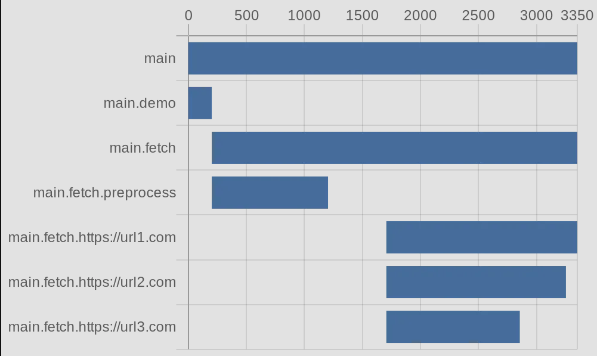

# StepsTrack

A simple JS implementation for tracking the time-used and data of the intermediate steps in a long function. Useful for enhancing performance of a pipeline-like functions that consists of parallel async functions.


StepTracker is a simple Typescript library for tracking the execution time of the intermediate steps in a long function. Useful for enhancing performance of a pipeline-like function that consists of multiple steps and/or conccurent async functions.

## Features

- Track intermediates data, results and execution time of all sub-steps
- Create Gantt chart URLs for visual representation of step durations

## Installation

```
npm install step-tracker
```

## Example

#### Sample Code
```
import { StepTracker } from '../dist';

const fetch = (url: string) => {
    return new Promise((resolve) => {
        setTimeout(() => {
            resolve(url);
        }, Math.floor(Math.random() * 3000) + 500);
    });
}

async function main() {
        
    const mainTracker = new StepTracker('main');

    await mainTracker.track(async (st: StepTracker) => {
       
        await st.step('demo', async (st: StepTracker) => {
        
            // Your logic here
            st.log('foo', 'bar');
            await new Promise(resolve => setTimeout(resolve, 200));
        });
        
        const urls = ['https://url1.com', 'https://url2.com', 'https://url3.com'];
        await st.step('fetch', async (st: StepTracker) => {
                
            await st.step('preprocess', async (st: StepTracker) => {
                
                // Some preprocess logic
                st.log('someData', 12345);
                await new Promise(resolve => setTimeout(resolve, 1000));
            });
        
            await new Promise(resolve => setTimeout(resolve, 500));
        
            // Concurrent sub steps
            await Promise.all(urls.map(async (url) => {
                return st.step(`${url}`, async (st: StepTracker) => {
                    return await fetch(url);
                });
            }));
        });
    });
    
    console.log(JSON.stringify(mainTracker.output(), null, 2));

    console.log(mainTracker.ganttUrl());
}

main();
```
#### Gantt Chart Output


## To Do
- Generate speed analysis based on multiple runs of the same function

## License
[MIT License](LICENSE)
