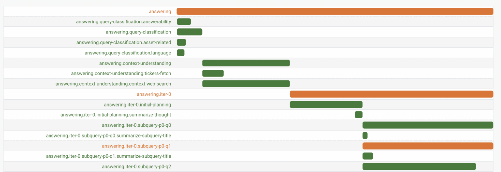

# PipeLens

[](https://badge.fury.io/js/pipelens)
[](https://www.npmjs.com/package/pipelens)
[](https://pypi.org/project/pipelens/)
[](https://pepy.tech/project/pipelens)
[](https://github.com/lokwkin/pipelens/actions/workflows/test-lib-ts.yml/badge.svg)
[](https://github.com/lokwkin/pipelens/actions/workflows/test-lib-py.yml/badge.svg)



***TLDR: Tracks every data and metrics during your pipeline run, and visualize it in easily tracable way.***

**PipeLens** is an observability tool built to help ***tracking, visualizing and inspecting*** intermediate steps in a complex ***pipeline-based application***. It automatically captures and stores the intermediate data, results and execution times of each steps in a pipeline, visualizing the execution details and allowing easier debug or analysis through an analytic dashboard. It is originally developed as a go-to tool to inspect runtime data of an agentic RAG pipeline.

It now supports both ***Python*** and ***Typescript / Node.js***

<details>
<summary>Background of PipeLens</summary>

> PipeLens is a lightweight inspection and debugging tool originally built to monitor an agentic Retrieval-Augmented Generation (RAG) pipeline running in a production environment—where visibility, performance, and stability are critical.
> 
> When chaining multiple LLM agents with custom logic and dynamic inputs, non-deterministic nature of LLM outputs of each steps often lead to dynamic route of logics and behaviors. I needed a inspection tool but the existing tools didn't provide the granularity I needed to trace what happened inside each step of the pipeline.
> 
> So I built PipeLens to do just that: trace, inspect, and understand every step of each request. It helped me quickly spot bottlenecks, unexpected behaviors and performance drags, and address them effectively.
> 
> I'm open-sourcing it in the hope that it helps others building and operating complex LLM pipelines.
>
> Contributions welcome!
</details>

⭐🌟 ***Sounds interesting? Kindly give it a Star, it means a lot!*** ⭐🌟

## Features

#### [1. Tracking Pipeline Steps](#tracking-pipeline-steps)
- **Tracking**: Define steps in pipeline to track intermediates data, results and execution time
- **Visualizing**: Exporting the details and generating basic visualizations including Gantt and Execution Graph
- **Event Emitting**: Listen to step events for real-time monitoring and custom handling
- **ES6 Decorators**: Easy integration with ES6 decorators
- **LLM Tracking Extension**: Simple tracker optimized for LLM usage

#### [2. Using Dashboard](#using-dashboard)
Monitor and analyze pipeline executions through an interactive web interface
- Detailed Steps Data and Results Insepection
- Real-time Execution Monitoring
- Gantt Chart Visualization for pipeline
- Step Execution Stats

*Note: PipeLens is designed for any pipeline-based / multi-steps logic, especially agentic LLM pipelines*

## Getting Started

This repository is a **monorepo** containing following packages:
- [Typescript](./packages/lib-ts) / [Python](./packages/lib-py) libraries that provides basic tracker and chart generation function for your pipeline
- [Dashboard](./packages/dashboard) that visualizes and allows you to monitor tracked data for analysis.

### Installation

```bash
# Typescript
npm install --save pipelens

# Python
pip install pipelens
```

### Tracking Pipeline Steps

Create a pipeline and track steps with nested, sequential, or parallel logic:

#### Simple Usage
<details>
<summary>Typescript</summary>

```typescript
import { Pipeline, Step } from 'pipelens';

const pipeline = new Pipeline('my_pipeline');

await pipeline.track(async (st: Step) => {

    // Track a simple step
    await st.step('some_step', async (st: Step) => {

      // ... your logic ...
      st.record('key', 'value'); // Record data for analysis

      return 'step_result'  // Results are automatically recorded
    });
    
    // Track nested steps
    await st.step('parent', async (st: Step) => {
      await st.step('child_1', async (st: Step) => { /* ... */ });
      await st.step('child_2', async (st: Step) => { /* ... */ });
  });
  
    // Track parallel steps
    await Promise.all([
        st.step('parallel_1', async (st: Step) => { /* ... */ }),
        st.step('parallel_2', async (st: Step) => { /* ... */ })
    ]);
});
```
</details>

<details>
<summary>Python</summary>

```python
from pipelens import Pipeline, Step, HttpTransport

# Create pipeline with HTTP transport
pipeline = Pipeline('my-pipeline')

# Run your pipeline
async def pipeline_logic(st: Step):

    async def some_task(some_args: str):
        # ... your logic ...
        st.record('key', 'value')  # Record data for analysis
        return 'some_result'  # Results are automatically recorded

    # Track a simple step
    result = await st.step('some_step', async lambda st: some_task(your_args, st))
    
    # Track nested steps
    await st.step('parent', async lambda st:
        await st.step('child_1', async lambda st: some_task(your_args, st))
        await st.step('child_2', async lambda st: some_task(your_args, st))
    )
    
    # Track parallel steps
    await asyncio.gather(
        st.step('parallel_1', async lambda st: some_task(your_args, st)),
        st.step('parallel_2', async lambda st: some_task(your_args, st))
    )

# Run the pipeline
await pipeline.track(pipeline_logic)
```
</details>

#### Using Decorators (Recommended)
<details>
<summary>Typescript</summary>

```typescript
import { Pipeline, Step, WithStep } from 'pipelens';

class PipelineController {
  private pipeline: Pipeline;

  constructor() {
    this.pipeline = new Pipeline('my_pipeline');
  }

  /**
   * Method to run the pipeline
   */
  public async run() {
    await this.pipeline.track(async (st: Step) => {
      await this.someStep('some_value', st);
      await this.parentFunc(st);
    });
  }

  @WithStep('some_step')
  async someStep(str: string, st: Step) {
    // ... some logic ...
    st.record('key', 'value');  // Record data for analysis

    return 'step_result'  // Results are automatically recorded
  }

  @WithStep('child')
  async childFunc(param: number, st: Step) {
    // ... some logic ...
  }

  @WithStep('parent')
  async parentFunc(st: Step) {
    // Track nested steps
    await this.childFunc(1, st);
    await this.childFunc(2, st);

    // Track parallel steps
    await Promise.all([
        this.childFunc(3, st),
        this.childFunc(4, st),
    ]);
  }
}

const controller = new PipelineController();
await controller.run();
```
</details>

<details>
<summary>Python</summary>

```python
from pipelens import Pipeline, Step, with_step

class PipelineController:
    def __init__(self):
        self.pipeline = Pipeline('my_pipeline')

    async def run(self):
        """Method to run the pipeline"""
        await self.pipeline.track(self._run_steps)

    async def _run_steps(self, st: Step):
        """Actual pipeline implementation method"""
        await self.some_step('some_value', st)
        await self.parent_func(st)

    @with_step('some_step')
    async def some_step(self, input_str: str, st: Step):
        # ... some logic ...
        await st.record('key', 'value')  # Record data for analysis
        return 'some_result'  # Results are automatically recorded

    @with_step('child')
    async def child_func(self, param: int, st: Step):
        # ... some logic ...

    @with_step('parent')
    async def parent_func(self, st: Step):
        # Track nested steps
        await self.child_func(1, st)
        await self.child_func(2, st)

        # Track parallel steps
        await asyncio.gather(
            self.child_func(3, st),
            self.child_func(4, st),
        )

controller = PipelineController()
await controller.run()
```
</details>

### Exporting and Visualizing Executions

Generate visual outputs to understand and analyze execution flow:

<details>
<summary>Typescript</summary>

```typescript
// Generate a Gantt chart Buffer using quickchart.io
const ganttChartBuffer = await pipeline.ganttQuickchart();

// Generate a Gantt chart HTML file with Google Charts
const ganttChartHtml = await pipeline.ganttGoogleChartHtml();

// Generate an execution graph URL
const executionGraphUrl = pipeline.executionGraphQuickchart();

// Get the hierarchical output of all steps
const stepsHierarchy = pipeline.outputNested();
```
</details>

<details>
<summary>Python</summary>

```python
# Generate a Gantt chart Buffer using quickchart.io
gantt_chart_buffer = await pipeline.gantt_quickchart()

# Generate a Gantt chart HTML file with Google Charts
gantt_chart_html = await pipeline.gantt_google_chart_html()

# Generate an execution graph URL
execution_graph_url = pipeline.execution_graph_quickchart()

# Get the hierarchical output of all steps
steps_hierarchy = pipeline.output_nested()
```
</details>

**Sample Gantt Chart**


**Sample Execution Graph**


**Sample Hierarchy Output**

<details>
<summary>json</summary>

```json
{
    "name": "document-parse",
    "key": "document-parse",
    "time": { "startTs": 1739357985509, "endTs": 1739357990192, "timeUsageMs": 4683 },
    "records": {},
    "substeps": [
        {
            "name": "preprocess",
            "key": "document-pipeline.preprocess",
            "time": { "startTs": 1739357985711, "endTs": 1739357986713, "timeUsageMs": 1002 },
            "records": {
                "pageCount": 3
            },
            "result": [ "page_1_content", "page_2_content"],
            "substeps": []
        },
        {
            "name": "parsing",
            "key": "document-pipeline.parsing",
            "time": { "startTs": 1739357985711, "endTs": 1739357990192, "timeUsageMs": 4481 },
            "records": {},
            "substeps": [
                {
                    "name": "page_1",
                    "key": "document-pipeline.parsing.page_1",
                    "time": { "startTs": 1739357987214, "endTs": 1739357990192, "timeUsageMs": 2978 },
                    "records": {},
                    "result": "page_1_content",
                    "substeps": []
                },
                {
                    "name": "page_2",
                    "key": "document-pipeline.parsing.page_2",
                    "time": { "startTs": 1739357987214, "endTs": 1739357989728, "timeUsageMs": 2514 },
                    "records": {},
                    "result": "page_2_content",
                    "substeps": []
                }
            ]
        },
        {
            "name": "sample-error",
            "key": "document-pipeline.sample-error",
            "time": { "startTs": 1739357990192, "endTs": 1739357990192, "timeUsageMs": 0},
            "records": {},
            "error": "Sample Error",
            "substeps": []
        }
    ]
}
```
</details>

### Advanced Usages

PipeLens also provides **Event Emitting** listeners, **ES6/Python Decorators** and - **LLM Tracking Extension** support for easier integration. For more detailed usages, check out the [Basic Usage](./docs/basic-usage.md) and [Advanced Usage](./docs/advanced-usage.md) guides.


## Using Dashboard

PipeLens includes a dashboard that provides several features for monitoring and analyzing pipeline executions. 

### Initial Configuration

During pipeline initialization, define a Transport to relay pipeline run data to dashboard later on. Currently supported a HttpTransport. See [Advanced Usage](./docs/advanced-usage.md) for more details.

<details>
<summary>Typescript</summary>

```typescript
const httpTransport = new HttpTransport({
  baseUrl: 'http://localhost:3000',
  batchLogs: true,
});

// Create pipeline with HTTP transport
const pipeline = new Pipeline('my-pipeline', {
  autoSave: 'real_time',
  transport: httpTransport
});

// Run your pipeline
await pipeline.track(async (st) => {
  // Your pipeline steps here
});

// Make sure to flush any pending logs when your application is shutting down
await httpTransport.flushAndStop();
```
</details>

<details>
<summary>Python</summary>

```python
from pipelens import Pipeline, Step, HttpTransport

http_transport = HttpTransport(HttpTransportOptions(
    base_url='http://localhost:3000',
    batch_logs=True
))

# Create pipeline with HTTP transport
pipeline = Pipeline('my-pipeline', 
    auto_save='real_time',
    transport=http_transport
)

# Run your pipeline
async def pipeline_logic(st):
    # Your pipeline steps here
    pass

await pipeline.track(pipeline_logic)

# Make sure to flush any pending logs when your application is shutting down
await http_transport.flush_and_stop()
```
</details>

### Starting up Dashboard

```bash
# Uses SQLite storage as default
docker run -p 3000:3000 lokwkin/pipelens-dashboard
```

See [Dashboard](./packages/dashboard) for more details.

### Detailed Steps Insepection

Details of a pipeline run. From here you can examine all the steps running in the pipeline, their auto-captured data and results as well as the time usage information.


### Real-time Execution Monitoring

The dashboard includes auto-refreshing option, allowing you to monitor real-time pipeline runs.


### Gantt Chart Visualization for pipeline

Gantt Chart for visualizing the time usages of each steps in a pipeline run. You can see real-time progress of the pipeline, highlighted by status of running / success / failed.


### Step Execution Stats

Step Execution Stats. Aggregated from past run histories with basic statistical information for performance analyzing.


## Roadmap and To Dos
- [X] Decorator support for easier integration.
- [X] Generate speed analysis stats from multiple runs.
- [X] Add Redis / File support for persistent data storage.
- [X] Dashboard to monitor execution logs and results.
- [X] Support real-time step exdcution monitoring.
- [X] Convert into mono-repo and split dashboard as independent dockerized module
- [X] Use GoogleChart / QuickChart instead of local chart.js generation
- [X] Enhance PipeLens Monitoring Dashboard UI/UX
- [X] Allow importing external logs into dashboard
- [X] Use Sqlite as a more appropriate persistence storage for analytic
- [X] Migrate dashboard storage to Dashboard. Use transport to relay logs.
- [X] Optional LLM-extension that optimize for LLM response and usage tracking
- [X] Data Retention Configuration
- [ ] Dashboard UX
    - [X] Filter to show selected step children 
    - [X] Custom step data display as column
    - [ ] Fix auto-refresh disabled when changed page
- [ ] Use memory-store instead of storing nested steps class in runtime
- [X] Support Python version of steps tracker


## License
MIT © [lokwkin](https://github.com/lokwkin)
